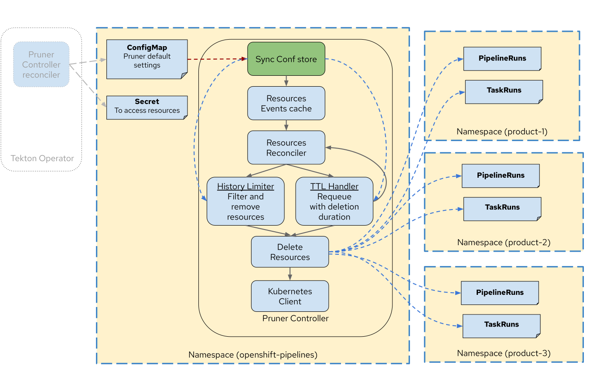

<!--

---
title: "Tekton resource pruning based on predefined configuration"
linkTitle: "Tekton Resource Pruning"
weight: 10
description: Configuration based event driven pruning solution for Tekton
cascade:
  github_project_repo: https://github.com/openshift-pipelines/tektoncd-pruner
---
-->

# Tekton Pruner

[](https://github.com/tektoncd/pruner/blob/main/LICENSE)

Tekton Pruner is a Kubernetes controller that automatically manages the lifecycle of Tekton resources by cleaning up completed PipelineRuns and TaskRuns based on configurable policies.

## Overview

Tekton Pruner provides event-driven and configuration-based cleanup of Tekton resources. It consists of three controllers:
- Main Pruner controller that periodically processes cleanup based on ConfigMap settings
- PipelineRun controller that handles PipelineRun events
- TaskRun controller that handles standalone TaskRun events

<p align="center">
</img>
</p>

## Features

### 1. Time-based Pruning (TTL)
- Automatically delete completed PipelineRuns and TaskRuns after a specified time period
- Configure using `ttlSecondsAfterFinished` setting

### 2. History-based Pruning
- Maintain a fixed number of PipelineRuns/TaskRuns based on their status
- Configure using:
  - `successfulHistoryLimit`: Number of successful runs to retain
  - `failedHistoryLimit`: Number of failed runs to retain 
  - `historyLimit`: Total number of runs to retain regardless of status

### 3. Flexible Configuration Hierarchy
Configurations can be applied at different levels (from highest to lowest priority):
1. Resource Level: Specific to individual PipelineRuns/TaskRuns
2. Namespace Level: Applied to all resources in a namespace
3. Global Level: Cluster-wide defaults

## Installation

Prerequisites:
- Kubernetes cluster
- [Tekton Pipelines](https://github.com/tektoncd/pipeline/blob/main/docs/install.md) installed

```bash
kubectl apply -f https://raw.githubusercontent.com/openshift-pipelines/tektoncd-pruner/main/release.yaml
```

Verify installation:
```bash
kubectl get pods -n tekton-pipelines
```

Look for the `tekton-pruner-controller` pod running.

## Configuration

The pruner is configured through a ConfigMap in the `tekton-pipelines` namespace. Here's a basic example:

```yaml
apiVersion: v1
kind: ConfigMap
metadata:
  name: tekton-pruner-default-spec
  namespace: tekton-pipelines
data:
  global-config: |
    enforcedConfigLevel: global
    ttlSecondsAfterFinished: 300    # 5 minutes
    successfulHistoryLimit: 3        # Keep last 3 successful runs
    failedHistoryLimit: 3           # Keep last 3 failed runs
    historyLimit: 10                # Keep last 10 runs total
```

### Namespace-specific Configuration

Override global settings for specific namespaces:

```yaml
data:
  global-config: |
    enforcedConfigLevel: namespace
    ttlSecondsAfterFinished: 300
    namespaces:
      my-namespace:
        ttlSecondsAfterFinished: 60  # Override for specific namespace
```

### Resource-specific Configuration

Configure pruning based on labels or annotations:

```yaml
data:
  global-config: |
    enforcedConfigLevel: resource
    namespaces:
      my-namespace:
        pipelineRuns:
          - name: my-pipeline
            ttlSecondsAfterFinished: 120
          - selector:
              matchLabels:
                environment: production
            ttlSecondsAfterFinished: 600
```

## Contributing

- See [DEVELOPMENT.md](DEVELOPMENT.md) for development setup
- Submit issues and pull requests
- Follow coding standards and test coverage requirements

## License

Apache License 2.0 - See [LICENSE](LICENSE) for details